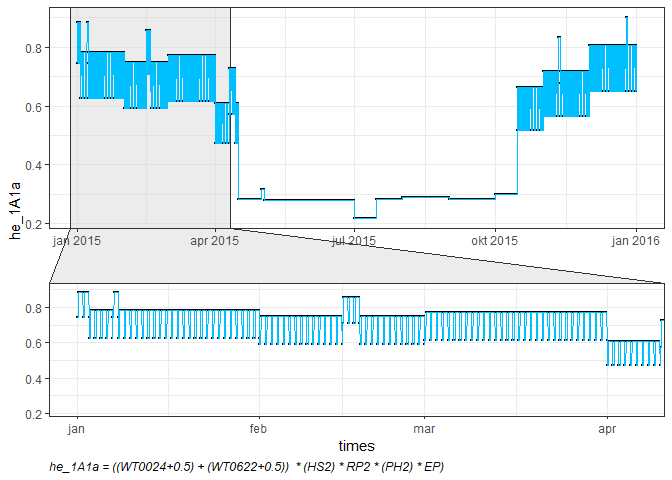
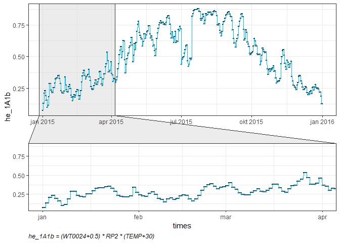
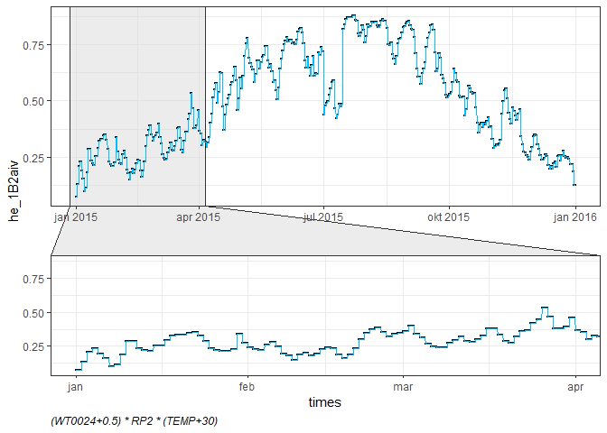
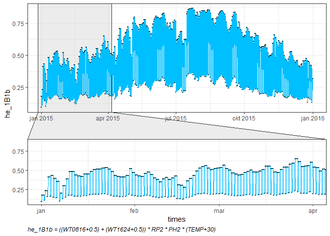

# 1A1 - Energy industries
This document provides the methodlogy and the main results regarding the temporal distribution of pollutation inventory.


<!--html_preserve--><div id="htmlwidget-84f66fa5c32c02aa95fb" style="width:100%;height:auto;" class="datatables html-widget"></div>
<script type="application/json" data-for="htmlwidget-84f66fa5c32c02aa95fb">{"x":{"filter":"none","caption":"<caption>Table: Label description<\/caption>","data":[["1","2","3","4","5","6","7","8","9","10","11","12","13","14","15","16","17","18","19","20"],["WD","WDWW","WT0816","WT1624","WT0024","WT0622","DL","WE","WW","RH0709","RH1517","PH","SA","HS","SAAG","TEMP","SLP","VA","NFH","RP"],["Working days","Working days, working weekends","Working time 08-16h","working time 16-24h","Working time 00-24h","Working time 06-22h","Day light","Weekends","Working weekends","Rush hours 07-09h","Rush hours 15-17h","Public holidays","Seasons","Heating Season","Agriculture Season","Temperature","Sea Level Pressure","Vehicles Trend Activity","Number of Flights per Hour","Repair - overhaul period"]],"container":"<table class=\"display\">\n  <thead>\n    <tr>\n      <th> <\/th>\n      <th>Label<\/th>\n      <th>Description<\/th>\n    <\/tr>\n  <\/thead>\n<\/table>","options":{"pageLength":25,"order":[],"autoWidth":false,"orderClasses":false,"columnDefs":[{"orderable":false,"targets":0}],"rowCallback":"function(row, data) {\nvar value=data[1]; $(this.api().cell(row, 1).node()).css({'background-color':'lightblue'});\n}"}},"evals":["options.rowCallback"],"jsHooks":[]}</script><!--/html_preserve-->


## 1A1a - Public heat and electricity production


<!--html_preserve--><div id="htmlwidget-f48e4f104f2b20dc2a04" style="width:100%;height:auto;" class="datatables html-widget"></div>
<script type="application/json" data-for="htmlwidget-f48e4f104f2b20dc2a04">{"x":{"filter":"none","caption":"<caption>Table 1: Total spatialized inventory<\/caption>","data":[["1"],[72456.57],[384008.49],[2407.59],[1045.52],[464.78],[0]],"container":"<table class=\"display\">\n  <thead>\n    <tr>\n      <th> <\/th>\n      <th>NOx<\/th>\n      <th>SO2<\/th>\n      <th>PM10<\/th>\n      <th>PM2.5<\/th>\n      <th>NMVOC<\/th>\n      <th>NH3<\/th>\n    <\/tr>\n  <\/thead>\n<\/table>","options":{"pageLength":5,"columnDefs":[{"className":"dt-right","targets":[1,2,3,4,5,6]},{"orderable":false,"targets":0}],"order":[],"autoWidth":false,"orderClasses":false,"lengthMenu":[5,10,25,50,100]}},"evals":[],"jsHooks":[]}</script><!--/html_preserve-->



<!--html_preserve--><div id="htmlwidget-d4078d7782a8a1cec118" style="width:100%;height:auto;" class="datatables html-widget"></div>
<script type="application/json" data-for="htmlwidget-d4078d7782a8a1cec118">{"x":{"filter":"none","caption":"<caption>Table 2: Function summary<\/caption>","data":[["1","2","3"],["Function - min","Function - max","Function - sum"],[0.218169361217048,0.901894247512075,4348.21682013694]],"container":"<table class=\"display\">\n  <thead>\n    <tr>\n      <th> <\/th>\n      <th>sum<\/th>\n      <th>Stat<\/th>\n    <\/tr>\n  <\/thead>\n<\/table>","options":{"pageLength":5,"columnDefs":[{"className":"dt-right","targets":2},{"orderable":false,"targets":0}],"order":[],"autoWidth":false,"orderClasses":false,"lengthMenu":[5,10,25,50,100]}},"evals":[],"jsHooks":[]}</script><!--/html_preserve-->


<!--html_preserve--><div id="htmlwidget-96c23520c14113314846" style="width:100%;height:auto;" class="datatables html-widget"></div>
<script type="application/json" data-for="htmlwidget-96c23520c14113314846">{"x":{"filter":"none","caption":"<caption>Table 3: Summary<\/caption>","data":[["1","2","3","4","5","6"],["NOx [%]","SO2 [%]","PM10 [%]","PM2.5 [%]","NMVOC [%]","NH3 [%]"],[100,100,100,100,100,0]],"container":"<table class=\"display\">\n  <thead>\n    <tr>\n      <th> <\/th>\n      <th>Emission<\/th>\n      <th>Sum<\/th>\n    <\/tr>\n  <\/thead>\n<\/table>","options":{"pageLength":5,"columnDefs":[{"className":"dt-right","targets":2},{"orderable":false,"targets":0}],"order":[],"autoWidth":false,"orderClasses":false,"lengthMenu":[5,10,25,50,100]}},"evals":[],"jsHooks":[]}</script><!--/html_preserve-->


```r
# sf.1A1a_df <- sf.1A1a %>% st_drop_geometry() #%>% dplyr::select(NOx)
# 
# sf.1A1a.tl <- lapply(sf.1A1a_df[,-1], function(x) t((x %o% he.1A1a$he_1A1a_n)[,,1]))
# 
# sf.1A1a.tl <- lapply(sf.1A1a.tl, function(x) data.frame(x) %>% mutate(Time = activity.df$times) %>% dplyr::select(Time, everything()))
# 
# # writexl::write_xlsx(sf.1A1a.tle, "sf.1A1a.tle.xlsx") # Mnogo traje...
# 
# vars <- names(sf.1A1a_df)[-1]
# 
# for(i in 1:length(vars)){
#   fwrite(sf.1A1a.tl[[i]], file = paste("sf.1A1a", paste(vars[i],"csv", sep = "."), sep = "_"))
# }
```


## 1A1b - Refineries


<!--html_preserve--><div id="htmlwidget-ffc0a08d6c670a3d2aa5" style="width:100%;height:auto;" class="datatables html-widget"></div>
<script type="application/json" data-for="htmlwidget-ffc0a08d6c670a3d2aa5">{"x":{"filter":"none","caption":"<caption>Table 1: Total spatialized inventory<\/caption>","data":[["1"],[172.9],[0.77],[2.44],[2.44],[7.08],[0]],"container":"<table class=\"display\">\n  <thead>\n    <tr>\n      <th> <\/th>\n      <th>NOx<\/th>\n      <th>SO2<\/th>\n      <th>PM10<\/th>\n      <th>PM2.5<\/th>\n      <th>NMVOC<\/th>\n      <th>NH3<\/th>\n    <\/tr>\n  <\/thead>\n<\/table>","options":{"pageLength":5,"columnDefs":[{"className":"dt-right","targets":[1,2,3,4,5,6]},{"orderable":false,"targets":0}],"order":[],"autoWidth":false,"orderClasses":false,"lengthMenu":[5,10,25,50,100]}},"evals":[],"jsHooks":[]}</script><!--/html_preserve-->



<!--html_preserve--><div id="htmlwidget-bda656b7f4cada5c50c3" style="width:100%;height:auto;" class="datatables html-widget"></div>
<script type="application/json" data-for="htmlwidget-bda656b7f4cada5c50c3">{"x":{"filter":"none","caption":"<caption>Table 2: Function summary<\/caption>","data":[["1","2","3"],["Function - min","Function - max","Function - sum"],[0.075684610202186,0.877610861828846,4358.19011015892]],"container":"<table class=\"display\">\n  <thead>\n    <tr>\n      <th> <\/th>\n      <th>sum<\/th>\n      <th>Stat<\/th>\n    <\/tr>\n  <\/thead>\n<\/table>","options":{"pageLength":5,"columnDefs":[{"className":"dt-right","targets":2},{"orderable":false,"targets":0}],"order":[],"autoWidth":false,"orderClasses":false,"lengthMenu":[5,10,25,50,100]}},"evals":[],"jsHooks":[]}</script><!--/html_preserve-->


<!--html_preserve--><div id="htmlwidget-a4eb7977e5a5aaeb7b6f" style="width:100%;height:auto;" class="datatables html-widget"></div>
<script type="application/json" data-for="htmlwidget-a4eb7977e5a5aaeb7b6f">{"x":{"filter":"none","caption":"<caption>Table 3: Summary<\/caption>","data":[["1","2","3","4","5","6"],["NOx [%]","SO2 [%]","PM10 [%]","PM2.5 [%]","NMVOC [%]","NH3 [%]"],[100,100,100,100,100,0]],"container":"<table class=\"display\">\n  <thead>\n    <tr>\n      <th> <\/th>\n      <th>Emission<\/th>\n      <th>Sum<\/th>\n    <\/tr>\n  <\/thead>\n<\/table>","options":{"pageLength":5,"columnDefs":[{"className":"dt-right","targets":2},{"orderable":false,"targets":0}],"order":[],"autoWidth":false,"orderClasses":false,"lengthMenu":[5,10,25,50,100]}},"evals":[],"jsHooks":[]}</script><!--/html_preserve-->


```r
# sf.1A1b_df <- sf.1A1b %>% st_drop_geometry() #%>% dplyr::select(NOx)
# 
# sf.1A1b.tl <- lapply(sf.1A1b_df[,-1], function(x) t((x %o% he.1A1b$he_1A1b_n)[,,1]))
# 
# sf.1A1b.tl <- lapply(sf.1A1b.tl, function(x) data.frame(x) %>% mutate(Time = activity.df$times) %>% dplyr::select(Time, everything()))
# 
# # str(sf.1A1b.tl)
# 
# # writexl::write_xlsx(sf.1A1b.tle, "sf.1A1b.tle.xlsx") # Mnogo traje...
# 
# vars <- names(sf.1A1b_df)[-1]
# 
# for(i in 1:length(vars)){
#   fwrite(sf.1A1b.tl[[i]], file = paste("sf.1A1b", paste(vars[i],"csv", sep = "."), sep = "_"))
# }
```


## 1B2aiv - Fugitive emissions from liquid fuels: Refining, storage


<!--html_preserve--><div id="htmlwidget-0ca6006f596487916d49" style="width:100%;height:auto;" class="datatables html-widget"></div>
<script type="application/json" data-for="htmlwidget-0ca6006f596487916d49">{"x":{"filter":"none","caption":"<caption>Table 1: Total spatialized inventory<\/caption>","data":[["1"],[704.53],[1820.04],[29.06],[12.62],[587.11],[3.23]],"container":"<table class=\"display\">\n  <thead>\n    <tr>\n      <th> <\/th>\n      <th>NOx<\/th>\n      <th>SO2<\/th>\n      <th>PM10<\/th>\n      <th>PM2.5<\/th>\n      <th>NMVOC<\/th>\n      <th>NH3<\/th>\n    <\/tr>\n  <\/thead>\n<\/table>","options":{"pageLength":5,"columnDefs":[{"className":"dt-right","targets":[1,2,3,4,5,6]},{"orderable":false,"targets":0}],"order":[],"autoWidth":false,"orderClasses":false,"lengthMenu":[5,10,25,50,100]}},"evals":[],"jsHooks":[]}</script><!--/html_preserve-->



<!--html_preserve--><div id="htmlwidget-950926ba8ebecf1bfc05" style="width:100%;height:auto;" class="datatables html-widget"></div>
<script type="application/json" data-for="htmlwidget-950926ba8ebecf1bfc05">{"x":{"filter":"none","caption":"<caption>Table 2: Function summary<\/caption>","data":[["1","2","3"],["Function - min","Function - max","Function - sum"],[0.075684610202186,0.877610861828846,4358.19011015892]],"container":"<table class=\"display\">\n  <thead>\n    <tr>\n      <th> <\/th>\n      <th>sum<\/th>\n      <th>Stat<\/th>\n    <\/tr>\n  <\/thead>\n<\/table>","options":{"pageLength":5,"columnDefs":[{"className":"dt-right","targets":2},{"orderable":false,"targets":0}],"order":[],"autoWidth":false,"orderClasses":false,"lengthMenu":[5,10,25,50,100]}},"evals":[],"jsHooks":[]}</script><!--/html_preserve-->


<!--html_preserve--><div id="htmlwidget-361a6a99598f60383765" style="width:100%;height:auto;" class="datatables html-widget"></div>
<script type="application/json" data-for="htmlwidget-361a6a99598f60383765">{"x":{"filter":"none","caption":"<caption>Table 3: Summary<\/caption>","data":[["1","2","3","4","5","6"],["NOx [%]","SO2 [%]","PM10 [%]","PM2.5 [%]","NMVOC [%]","NH3 [%]"],[100,100,100,100,100,100]],"container":"<table class=\"display\">\n  <thead>\n    <tr>\n      <th> <\/th>\n      <th>Emission<\/th>\n      <th>Sum<\/th>\n    <\/tr>\n  <\/thead>\n<\/table>","options":{"pageLength":5,"columnDefs":[{"className":"dt-right","targets":2},{"orderable":false,"targets":0}],"order":[],"autoWidth":false,"orderClasses":false,"lengthMenu":[5,10,25,50,100]}},"evals":[],"jsHooks":[]}</script><!--/html_preserve-->


```r
# sf.1B2aiv_df <- sf.1B2aiv %>% st_drop_geometry() #%>% dplyr::select(NOx)
# 
# sf.1B2aiv.tl <- lapply(sf.1B2aiv_df[,-1], function(x) t((x %o% he.1B2aiv$he_1B2aiv_n)[,,1]))
# 
# sf.1B2aiv.tl <- lapply(sf.1B2aiv.tl, function(x) data.frame(x) %>% mutate(Time = activity.df$times) %>% dplyr::select(Time, everything()))
# 
# # str(sf.1B2aiv.tl)
# 
# # writexl::write_xlsx(sf.1B2aiv.tle, "sf.1B2aiv.tle.xlsx") # Mnogo traje...
# 
# vars <- names(sf.1B2aiv_df)[-1]
# 
# for(i in 1:length(vars)){
#   fwrite(sf.1B2aiv.tl[[i]], file = paste("sf.1B2aiv", paste(vars[i],"csv", sep = "."), sep = "_"))
# }
```


## 1B2c - Fugitive emissions: Venting and flaring


<!--html_preserve--><div id="htmlwidget-22ca531fdffa0c08df92" style="width:100%;height:auto;" class="datatables html-widget"></div>
<script type="application/json" data-for="htmlwidget-22ca531fdffa0c08df92">{"x":{"filter":"none","caption":"<caption>Table 1: Total spatialized inventory<\/caption>","data":[["1"],[0.28],[0.39],[0],[0],[0.01],[0]],"container":"<table class=\"display\">\n  <thead>\n    <tr>\n      <th> <\/th>\n      <th>NOx<\/th>\n      <th>SO2<\/th>\n      <th>PM10<\/th>\n      <th>PM2.5<\/th>\n      <th>NMVOC<\/th>\n      <th>NH3<\/th>\n    <\/tr>\n  <\/thead>\n<\/table>","options":{"pageLength":5,"columnDefs":[{"className":"dt-right","targets":[1,2,3,4,5,6]},{"orderable":false,"targets":0}],"order":[],"autoWidth":false,"orderClasses":false,"lengthMenu":[5,10,25,50,100]}},"evals":[],"jsHooks":[]}</script><!--/html_preserve-->


<!--html_preserve--><div id="htmlwidget-ec5ad2a2587157527519" style="width:100%;height:auto;" class="datatables html-widget"></div>
<script type="application/json" data-for="htmlwidget-ec5ad2a2587157527519">{"x":{"filter":"none","caption":"<caption>Table 2: Function summary<\/caption>","data":[["1","2","3"],["Function - min","Function - max","Function - sum"],[0.075684610202186,0.877610861828846,4358.19011015892]],"container":"<table class=\"display\">\n  <thead>\n    <tr>\n      <th> <\/th>\n      <th>sum<\/th>\n      <th>Stat<\/th>\n    <\/tr>\n  <\/thead>\n<\/table>","options":{"pageLength":5,"columnDefs":[{"className":"dt-right","targets":2},{"orderable":false,"targets":0}],"order":[],"autoWidth":false,"orderClasses":false,"lengthMenu":[5,10,25,50,100]}},"evals":[],"jsHooks":[]}</script><!--/html_preserve-->


<!--html_preserve--><div id="htmlwidget-ec0688d2cf2798e14713" style="width:100%;height:auto;" class="datatables html-widget"></div>
<script type="application/json" data-for="htmlwidget-ec0688d2cf2798e14713">{"x":{"filter":"none","caption":"<caption>Table 3: Summary<\/caption>","data":[["1","2","3","4","5","6"],["NOx [%]","SO2 [%]","PM10 [%]","PM2.5 [%]","NMVOC [%]","NH3 [%]"],[100,100,0,0,100,0]],"container":"<table class=\"display\">\n  <thead>\n    <tr>\n      <th> <\/th>\n      <th>Emission<\/th>\n      <th>Sum<\/th>\n    <\/tr>\n  <\/thead>\n<\/table>","options":{"pageLength":5,"columnDefs":[{"className":"dt-right","targets":2},{"orderable":false,"targets":0}],"order":[],"autoWidth":false,"orderClasses":false,"lengthMenu":[5,10,25,50,100]}},"evals":[],"jsHooks":[]}</script><!--/html_preserve-->


```r
# sf.1B2c_df <- sf.1B2c %>% st_drop_geometry() #%>% dplyr::select(NOx)
# 
# sf.1B2c.tl <- lapply(sf.1B2c_df[,-1], function(x) t((x %o% he.1B2c$he_1B2c_n)[,,1]))
# 
# sf.1B2c.tl <- lapply(sf.1B2c.tl, function(x) data.frame(x) %>% mutate(Time = activity.df$times) %>% dplyr::select(Time, everything()))
# 
# # str(sf.1B2c.tl)
# 
# # writexl::write_xlsx(sf.1B2c.tle, "sf.1B2c.tle.xlsx") # Mnogo traje...
# 
# vars <- names(sf.1B2c_df)[-1]
# 
# for(i in 1:length(vars)){
#   fwrite(sf.1B2c.tl[[i]], file = paste("sf.1B2c", paste(vars[i],"csv", sep = "."), sep = "_"))
# }
```


## 1A1c - Manufacturing of solid fuels


<!--html_preserve--><div id="htmlwidget-322a8db63233fa5abe69" style="width:100%;height:auto;" class="datatables html-widget"></div>
<script type="application/json" data-for="htmlwidget-322a8db63233fa5abe69">{"x":{"filter":"none","caption":"<caption>Table 1: Total spatialized inventory<\/caption>","data":[["1"],[227.81],[987.17],[856.99],[596.64],[8.68],[0]],"container":"<table class=\"display\">\n  <thead>\n    <tr>\n      <th> <\/th>\n      <th>NOx<\/th>\n      <th>SO2<\/th>\n      <th>PM10<\/th>\n      <th>PM2.5<\/th>\n      <th>NMVOC<\/th>\n      <th>NH3<\/th>\n    <\/tr>\n  <\/thead>\n<\/table>","options":{"pageLength":5,"columnDefs":[{"className":"dt-right","targets":[1,2,3,4,5,6]},{"orderable":false,"targets":0}],"order":[],"autoWidth":false,"orderClasses":false,"lengthMenu":[5,10,25,50,100]}},"evals":[],"jsHooks":[]}</script><!--/html_preserve-->


<!--html_preserve--><div id="htmlwidget-f1a735127450db0f3d7d" style="width:100%;height:auto;" class="datatables html-widget"></div>
<script type="application/json" data-for="htmlwidget-f1a735127450db0f3d7d">{"x":{"filter":"none","caption":"<caption>Table 2: Function summary<\/caption>","data":[["1","2","3"],["Function - min","Function - max","Function - sum"],[0.0956320466027471,0.864225331343792,4386.30695652704]],"container":"<table class=\"display\">\n  <thead>\n    <tr>\n      <th> <\/th>\n      <th>sum<\/th>\n      <th>Stat<\/th>\n    <\/tr>\n  <\/thead>\n<\/table>","options":{"pageLength":5,"columnDefs":[{"className":"dt-right","targets":2},{"orderable":false,"targets":0}],"order":[],"autoWidth":false,"orderClasses":false,"lengthMenu":[5,10,25,50,100]}},"evals":[],"jsHooks":[]}</script><!--/html_preserve-->


<!--html_preserve--><div id="htmlwidget-bafdfa71fb428a86e199" style="width:100%;height:auto;" class="datatables html-widget"></div>
<script type="application/json" data-for="htmlwidget-bafdfa71fb428a86e199">{"x":{"filter":"none","caption":"<caption>Table 3: Summary<\/caption>","data":[["1","2","3","4","5","6"],["NOx [%]","SO2 [%]","PM10 [%]","PM2.5 [%]","NMVOC [%]","NH3 [%]"],[100,100,100,100,100,0]],"container":"<table class=\"display\">\n  <thead>\n    <tr>\n      <th> <\/th>\n      <th>Emission<\/th>\n      <th>Sum<\/th>\n    <\/tr>\n  <\/thead>\n<\/table>","options":{"pageLength":5,"columnDefs":[{"className":"dt-right","targets":2},{"orderable":false,"targets":0}],"order":[],"autoWidth":false,"orderClasses":false,"lengthMenu":[5,10,25,50,100]}},"evals":[],"jsHooks":[]}</script><!--/html_preserve-->


```r
# sf.1A1c_df <- sf.1A1c %>% st_drop_geometry() #%>% dplyr::select(NOx)
# 
# sf.1A1c.tl <- lapply(sf.1A1c_df[,-1], function(x) t((x %o% he.1A1c$he_1A1c_n)[,,1]))
# 
# sf.1A1c.tl <- lapply(sf.1A1c.tl, function(x) data.frame(x) %>% mutate(Time = activity.df$times) %>% dplyr::select(Time, everything()))
# 
# # str(sf.1A1c.tl)
# 
# # writexl::write_xlsx(sf.1A1c.tle, "sf.1A1c.tle.xlsx") # Mnogo traje...
# 
# # vars <- names(sf.1A1c_df)[-1]
# 
# for(i in 1:length(vars)){
#   fwrite(sf.1A1c.tl[[i]], file = paste("sf.1A1c", paste(vars[i],"csv", sep = "."), sep = "_"))
# }
```


## 1B1b - Fugitive emissions from solid fuels: Solid fuel transformation


<!--html_preserve--><div id="htmlwidget-bd25957609067a833ae1" style="width:100%;height:auto;" class="datatables html-widget"></div>
<script type="application/json" data-for="htmlwidget-bd25957609067a833ae1">{"x":{"filter":"none","caption":"<caption>Table 1: Total spatialized inventory<\/caption>","data":[["1"],[0.53],[0.47],[85.56],[35.75],[4.51],[2.17]],"container":"<table class=\"display\">\n  <thead>\n    <tr>\n      <th> <\/th>\n      <th>NOx<\/th>\n      <th>SO2<\/th>\n      <th>PM10<\/th>\n      <th>PM2.5<\/th>\n      <th>NMVOC<\/th>\n      <th>NH3<\/th>\n    <\/tr>\n  <\/thead>\n<\/table>","options":{"pageLength":5,"columnDefs":[{"className":"dt-right","targets":[1,2,3,4,5,6]},{"orderable":false,"targets":0}],"order":[],"autoWidth":false,"orderClasses":false,"lengthMenu":[5,10,25,50,100]}},"evals":[],"jsHooks":[]}</script><!--/html_preserve-->



<!--html_preserve--><div id="htmlwidget-b82f6197fc9198a6bed5" style="width:100%;height:auto;" class="datatables html-widget"></div>
<script type="application/json" data-for="htmlwidget-b82f6197fc9198a6bed5">{"x":{"filter":"none","caption":"<caption>Table 2: Function summary<\/caption>","data":[["1","2","3"],["Function - min","Function - max","Function - sum"],[0.0956320466027471,0.864225331343792,4386.30695652704]],"container":"<table class=\"display\">\n  <thead>\n    <tr>\n      <th> <\/th>\n      <th>sum<\/th>\n      <th>Stat<\/th>\n    <\/tr>\n  <\/thead>\n<\/table>","options":{"pageLength":5,"columnDefs":[{"className":"dt-right","targets":2},{"orderable":false,"targets":0}],"order":[],"autoWidth":false,"orderClasses":false,"lengthMenu":[5,10,25,50,100]}},"evals":[],"jsHooks":[]}</script><!--/html_preserve-->


<!--html_preserve--><div id="htmlwidget-77ce7f9a1e54dd64f872" style="width:100%;height:auto;" class="datatables html-widget"></div>
<script type="application/json" data-for="htmlwidget-77ce7f9a1e54dd64f872">{"x":{"filter":"none","caption":"<caption>Table 3: Summary<\/caption>","data":[["1","2","3","4","5","6"],["NOx [%]","SO2 [%]","PM10 [%]","PM2.5 [%]","NMVOC [%]","NH3 [%]"],[100,100,100,100,100,100]],"container":"<table class=\"display\">\n  <thead>\n    <tr>\n      <th> <\/th>\n      <th>Emission<\/th>\n      <th>Sum<\/th>\n    <\/tr>\n  <\/thead>\n<\/table>","options":{"pageLength":5,"columnDefs":[{"className":"dt-right","targets":2},{"orderable":false,"targets":0}],"order":[],"autoWidth":false,"orderClasses":false,"lengthMenu":[5,10,25,50,100]}},"evals":[],"jsHooks":[]}</script><!--/html_preserve-->


```r
# sf.1B1b_df <- sf.1B1b %>% st_drop_geometry() #%>% dplyr::select(NOx)
# 
# sf.1B1b.tl <- lapply(sf.1B1b_df[,-1], function(x) t((x %o% he.1B1b$he_1B1b_n)[,,1]))
# 
# sf.1B1b.tl <- lapply(sf.1B1b.tl, function(x) data.frame(x) %>% mutate(Time = activity.df$times) %>% dplyr::select(Time, everything()))
# 
# # str(sf.1B1b.tl)
# 
# # writexl::write_xlsx(sf.1B1b.tle, "sf.1B1b.tle.xlsx") # Mnogo traje...
# 
# # vars <- names(sf.1B1b_df)[-1]
# 
# # for(i in 1:length(vars)){
# #   fwrite(sf.1B1b.tl[[i]], file = here::here("Hourly_emissions", "Products", "Energy_TemporalByCell", paste("1B1b", paste(vars[i],"csv", sep = "."), sep = "_")))
# # }
# 
# for(i in 1:length(vars)){
#   fwrite(sf.1B1b.tl[[i]], file = paste("sf.1B1b", paste(vars[i],"csv", sep = "."), sep = "_"))
# }


# temporalProfile_Energy <- activity.df$times %>% 
#  cbind(he.1A1a[,1:6], 
#        he.1A1b[,1:6], 
#        he.1A1c[,1:6], 
#        he.1B1b[,1 :6], 
#        he.1B2aiv[,1:6], 
#        he.1B2c[,1:6]) %>% 
#   as.data.frame()
# 
# writexl::write_xlsx(temporalProfile_Energy, path = 'Hourly_emissions/Products/TemporalProfile_Energy_industries.xlsx')
```


---
title: "1A1---Energy_industries_TEMPORAL.R"
author: "Petar"
date: "2020-03-11"
---

