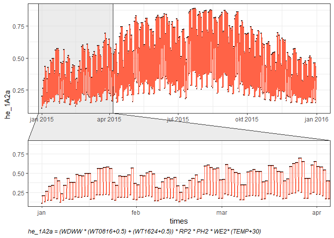

# 1A2 / 2 - Industrial processes
This document provides the methodlogy and the main results regarding the temporal distribution of pollutation inventory.


<!--html_preserve--><div id="htmlwidget-a7397fdfa10c9d1f422d" style="width:100%;height:auto;" class="datatables html-widget"></div>
<script type="application/json" data-for="htmlwidget-a7397fdfa10c9d1f422d">{"x":{"filter":"none","caption":"<caption>Table: Label description<\/caption>","data":[["1","2","3","4","5","6","7","8","9","10","11","12","13","14","15","16","17","18","19","20"],["WD","WDWW","WT0816","WT1624","WT0622","DL","WE","WW","RH0709","RH1517","PH","SA","HS","SAAG","TEMP","SLP","VA","NFH","RP","EC"],["Working days","Working days, working weekends","Working time 08-16h","working time 16-24h","Working time 06-22h","Day light","Weekends","Working weekends","Rush hours 07-09h","Rush hours 15-17h","Public holidays","Seasons","Heating Season","Agriculture Season","Temperature","Sea Level Pressure","Vehicles Trend Activity","Number of Flights per Hour","Repair - overhaul period","Electricity consumption"]],"container":"<table class=\"display\">\n  <thead>\n    <tr>\n      <th> <\/th>\n      <th>Label<\/th>\n      <th>Description<\/th>\n    <\/tr>\n  <\/thead>\n<\/table>","options":{"pageLength":25,"order":[],"autoWidth":false,"orderClasses":false,"columnDefs":[{"orderable":false,"targets":0}],"rowCallback":"function(row, data) {\nvar value=data[1]; $(this.api().cell(row, 1).node()).css({'background-color':'lightblue'});\n}"}},"evals":["options.rowCallback"],"jsHooks":[]}</script><!--/html_preserve-->


## 1A2a / 2C1 - Iron and Steel


<!--html_preserve--><div id="htmlwidget-6fbdabc8a4e492603e8e" style="width:100%;height:auto;" class="datatables html-widget"></div>
<script type="application/json" data-for="htmlwidget-6fbdabc8a4e492603e8e">{"x":{"filter":"none","caption":"<caption>Table 1: Total spatialized inventory<\/caption>","data":[["1"],[689.19],[473.81],[173.39],[134.21],[130.79],[0]],"container":"<table class=\"display\">\n  <thead>\n    <tr>\n      <th> <\/th>\n      <th>NOx<\/th>\n      <th>SO2<\/th>\n      <th>PM10<\/th>\n      <th>PM2.5<\/th>\n      <th>NMVOC<\/th>\n      <th>NH3<\/th>\n    <\/tr>\n  <\/thead>\n<\/table>","options":{"pageLength":5,"columnDefs":[{"className":"dt-right","targets":[1,2,3,4,5,6]},{"orderable":false,"targets":0}],"order":[],"autoWidth":false,"orderClasses":false,"lengthMenu":[5,10,25,50,100]}},"evals":[],"jsHooks":[]}</script><!--/html_preserve-->



<!--html_preserve--><div id="htmlwidget-9c79a64943161d1df614" style="width:100%;height:auto;" class="datatables html-widget"></div>
<script type="application/json" data-for="htmlwidget-9c79a64943161d1df614">{"x":{"filter":"none","caption":"<caption>Table 2: Function summary<\/caption>","data":[["1","2","3"],["Function - min","Function - max","Function - sum"],[0.109058450102077,0.886458403187087,4369.98569584066]],"container":"<table class=\"display\">\n  <thead>\n    <tr>\n      <th> <\/th>\n      <th>sum<\/th>\n      <th>Stat<\/th>\n    <\/tr>\n  <\/thead>\n<\/table>","options":{"pageLength":5,"columnDefs":[{"className":"dt-right","targets":2},{"orderable":false,"targets":0}],"order":[],"autoWidth":false,"orderClasses":false,"lengthMenu":[5,10,25,50,100]}},"evals":[],"jsHooks":[]}</script><!--/html_preserve-->


<!--html_preserve--><div id="htmlwidget-b7933d3b0f6a14c68474" style="width:100%;height:auto;" class="datatables html-widget"></div>
<script type="application/json" data-for="htmlwidget-b7933d3b0f6a14c68474">{"x":{"filter":"none","caption":"<caption>Table 3: Summary<\/caption>","data":[["1","2","3","4","5","6"],["NOx [%]","SO2 [%]","PM10 [%]","PM2.5 [%]","NMVOC [%]","NH3 [%]"],[100,100,100,100,100,0]],"container":"<table class=\"display\">\n  <thead>\n    <tr>\n      <th> <\/th>\n      <th>Emission<\/th>\n      <th>Sum<\/th>\n    <\/tr>\n  <\/thead>\n<\/table>","options":{"pageLength":5,"columnDefs":[{"className":"dt-right","targets":2},{"orderable":false,"targets":0}],"order":[],"autoWidth":false,"orderClasses":false,"lengthMenu":[5,10,25,50,100]}},"evals":[],"jsHooks":[]}</script><!--/html_preserve-->


```r
# sf.1A2a_df <- sf.1A2a %>% st_drop_geometry() #%>% dplyr::select(NOx)
# 
# sf.1A2a.tl <- lapply(sf.1A2a_df[,-1], function(x) t((x %o% he.1A2a$he_1A2a_n)[,,1]))
# 
# sf.1A2a.tl <- lapply(sf.1A2a.tl, function(x) data.frame(x) %>% mutate(Time = activity.df$times) %>% dplyr::select(Time, everything()))
# 
# # writexl::write_xlsx(sf.1A2a.tle, "sf.1A2a.tle.xlsx") # Mnogo traje...
# 
# vars <- names(sf.1A2a_df)[-1]
# 
# for(i in 1:length(vars)){
#   fwrite(sf.1A2a.tl[[i]], file = paste("sf.1A2a", paste(vars[i],"csv", sep = "."), sep = "_"))
# }
```


## 1A2b - Non-ferrous metals


<!--html_preserve--><div id="htmlwidget-43f83a4a8d6f415d9269" style="width:100%;height:auto;" class="datatables html-widget"></div>
<script type="application/json" data-for="htmlwidget-43f83a4a8d6f415d9269">{"x":{"filter":"none","caption":"<caption>Table 1: Total spatialized inventory<\/caption>","data":[["1"],[317.31],[997.7],[90.61],[77.78],[0],[0]],"container":"<table class=\"display\">\n  <thead>\n    <tr>\n      <th> <\/th>\n      <th>NOx<\/th>\n      <th>SO2<\/th>\n      <th>PM10<\/th>\n      <th>PM2.5<\/th>\n      <th>NMVOC<\/th>\n      <th>NH3<\/th>\n    <\/tr>\n  <\/thead>\n<\/table>","options":{"pageLength":5,"columnDefs":[{"className":"dt-right","targets":[1,2,3,4,5,6]},{"orderable":false,"targets":0}],"order":[],"autoWidth":false,"orderClasses":false,"lengthMenu":[5,10,25,50,100]}},"evals":[],"jsHooks":[]}</script><!--/html_preserve-->


<!--html_preserve--><div id="htmlwidget-a0fe6b461269c7c3cdc7" style="width:100%;height:auto;" class="datatables html-widget"></div>
<script type="application/json" data-for="htmlwidget-a0fe6b461269c7c3cdc7">{"x":{"filter":"none","caption":"<caption>Table 2: Function summary<\/caption>","data":[["1","2","3"],["Function - min","Function - max","Function - sum"],[0.109058450102077,0.886458403187087,4369.98569584066]],"container":"<table class=\"display\">\n  <thead>\n    <tr>\n      <th> <\/th>\n      <th>sum<\/th>\n      <th>Stat<\/th>\n    <\/tr>\n  <\/thead>\n<\/table>","options":{"pageLength":5,"columnDefs":[{"className":"dt-right","targets":2},{"orderable":false,"targets":0}],"order":[],"autoWidth":false,"orderClasses":false,"lengthMenu":[5,10,25,50,100]}},"evals":[],"jsHooks":[]}</script><!--/html_preserve-->


<!--html_preserve--><div id="htmlwidget-765827556a69dcec8212" style="width:100%;height:auto;" class="datatables html-widget"></div>
<script type="application/json" data-for="htmlwidget-765827556a69dcec8212">{"x":{"filter":"none","caption":"<caption>Table 3: Summary<\/caption>","data":[["1","2","3","4","5","6"],["NOx [%]","SO2 [%]","PM10 [%]","PM2.5 [%]","NMVOC [%]","NH3 [%]"],[100,100,100,100,0,0]],"container":"<table class=\"display\">\n  <thead>\n    <tr>\n      <th> <\/th>\n      <th>Emission<\/th>\n      <th>Sum<\/th>\n    <\/tr>\n  <\/thead>\n<\/table>","options":{"pageLength":5,"columnDefs":[{"className":"dt-right","targets":2},{"orderable":false,"targets":0}],"order":[],"autoWidth":false,"orderClasses":false,"lengthMenu":[5,10,25,50,100]}},"evals":[],"jsHooks":[]}</script><!--/html_preserve-->


```r
# sf.1A2b_df <- sf.1A2b %>% st_drop_geometry() #%>% dplyr::select(NOx)
# 
# sf.1A2b.tl <- lapply(sf.1A2b_df[,-1], function(x) t((x %o% he.1A2b$he_1A2b_n)[,,1]))
# 
# sf.1A2b.tl <- lapply(sf.1A2b.tl, function(x) data.frame(x) %>% mutate(Time = activity.df$times) %>% dplyr::select(Time, everything()))
# 
# # writexl::write_xlsx(sf.1A2b.tle, "sf.1A2b.tle.xlsx") # Mnogo traje...
# 
# vars <- names(sf.1A2b_df)[-1]
# 
# for(i in 1:length(vars)){
#   fwrite(sf.1A2b.tl[[i]], file = paste("sf.1A2b", paste(vars[i],"csv", sep = "."), sep = "_"))
# }
```


## 1A2c - Chemicals


<!--html_preserve--><div id="htmlwidget-77611fc17a3b52d1594d" style="width:100%;height:auto;" class="datatables html-widget"></div>
<script type="application/json" data-for="htmlwidget-77611fc17a3b52d1594d">{"x":{"filter":"none","caption":"<caption>Table 1: Total spatialized inventory<\/caption>","data":[["1"],[11.81],[2.68],[1.49],[1.23],[20.5],[3613.96]],"container":"<table class=\"display\">\n  <thead>\n    <tr>\n      <th> <\/th>\n      <th>NOx<\/th>\n      <th>SO2<\/th>\n      <th>PM10<\/th>\n      <th>PM2.5<\/th>\n      <th>NMVOC<\/th>\n      <th>NH3<\/th>\n    <\/tr>\n  <\/thead>\n<\/table>","options":{"pageLength":5,"columnDefs":[{"className":"dt-right","targets":[1,2,3,4,5,6]},{"orderable":false,"targets":0}],"order":[],"autoWidth":false,"orderClasses":false,"lengthMenu":[5,10,25,50,100]}},"evals":[],"jsHooks":[]}</script><!--/html_preserve-->


<!--html_preserve--><div id="htmlwidget-efbd196df711cabcc8ae" style="width:100%;height:auto;" class="datatables html-widget"></div>
<script type="application/json" data-for="htmlwidget-efbd196df711cabcc8ae">{"x":{"filter":"none","caption":"<caption>Table 2: Function summary<\/caption>","data":[["1","2","3"],["Function - min","Function - max","Function - sum"],[0.109058450102077,0.886458403187087,4369.98569584066]],"container":"<table class=\"display\">\n  <thead>\n    <tr>\n      <th> <\/th>\n      <th>sum<\/th>\n      <th>Stat<\/th>\n    <\/tr>\n  <\/thead>\n<\/table>","options":{"pageLength":5,"columnDefs":[{"className":"dt-right","targets":2},{"orderable":false,"targets":0}],"order":[],"autoWidth":false,"orderClasses":false,"lengthMenu":[5,10,25,50,100]}},"evals":[],"jsHooks":[]}</script><!--/html_preserve-->


<!--html_preserve--><div id="htmlwidget-285a5f703d78cedd7528" style="width:100%;height:auto;" class="datatables html-widget"></div>
<script type="application/json" data-for="htmlwidget-285a5f703d78cedd7528">{"x":{"filter":"none","caption":"<caption>Table 3: Summary<\/caption>","data":[["1","2","3","4","5","6"],["NOx [%]","SO2 [%]","PM10 [%]","PM2.5 [%]","NMVOC [%]","NH3 [%]"],[100,100,100,100,100,100]],"container":"<table class=\"display\">\n  <thead>\n    <tr>\n      <th> <\/th>\n      <th>Emission<\/th>\n      <th>Sum<\/th>\n    <\/tr>\n  <\/thead>\n<\/table>","options":{"pageLength":5,"columnDefs":[{"className":"dt-right","targets":2},{"orderable":false,"targets":0}],"order":[],"autoWidth":false,"orderClasses":false,"lengthMenu":[5,10,25,50,100]}},"evals":[],"jsHooks":[]}</script><!--/html_preserve-->


```r
# sf.1A2c_df <- sf.1A2c %>% st_drop_geometry() #%>% dplyr::select(NOx)
# 
# sf.1A2c.tl <- lapply(sf.1A2c_df[,-1], function(x) t((x %o% he.1A2c$he_1A2c_n)[,,1]))
# 
# sf.1A2c.tl <- lapply(sf.1A2c.tl, function(x) data.frame(x) %>% mutate(Time = activity.df$times) %>% dplyr::select(Time, everything()))
# 
# # writexl::write_xlsx(sf.1A2c.tle, "sf.1A2c.tle.xlsx") # Mnogo traje...
# 
# vars <- names(sf.1A2c_df)[-1]
# 
# for(i in 1:length(vars)){
#   fwrite(sf.1A2c.tl[[i]], file = paste("sf.1A2c", paste(vars[i],"csv", sep = "."), sep = "_"))
# }
```


## 1A2d - Pulp, paper and print


<!--html_preserve--><div id="htmlwidget-1e90c330f6f5495a81ec" style="width:100%;height:auto;" class="datatables html-widget"></div>
<script type="application/json" data-for="htmlwidget-1e90c330f6f5495a81ec">{"x":{"filter":"none","caption":"<caption>Table 1: Total spatialized inventory<\/caption>","data":[["1"],[729.94],[1141.95],[546.16],[451.67],[1267.13],[40.59]],"container":"<table class=\"display\">\n  <thead>\n    <tr>\n      <th> <\/th>\n      <th>NOx<\/th>\n      <th>SO2<\/th>\n      <th>PM10<\/th>\n      <th>PM2.5<\/th>\n      <th>NMVOC<\/th>\n      <th>NH3<\/th>\n    <\/tr>\n  <\/thead>\n<\/table>","options":{"pageLength":5,"columnDefs":[{"className":"dt-right","targets":[1,2,3,4,5,6]},{"orderable":false,"targets":0}],"order":[],"autoWidth":false,"orderClasses":false,"lengthMenu":[5,10,25,50,100]}},"evals":[],"jsHooks":[]}</script><!--/html_preserve-->


<!--html_preserve--><div id="htmlwidget-2aba257eac84a03afd58" style="width:100%;height:auto;" class="datatables html-widget"></div>
<script type="application/json" data-for="htmlwidget-2aba257eac84a03afd58">{"x":{"filter":"none","caption":"<caption>Table 2: Function summary<\/caption>","data":[["1","2","3"],["Function - min","Function - max","Function - sum"],[0.109058450102077,0.886458403187087,4369.98569584066]],"container":"<table class=\"display\">\n  <thead>\n    <tr>\n      <th> <\/th>\n      <th>sum<\/th>\n      <th>Stat<\/th>\n    <\/tr>\n  <\/thead>\n<\/table>","options":{"pageLength":5,"columnDefs":[{"className":"dt-right","targets":2},{"orderable":false,"targets":0}],"order":[],"autoWidth":false,"orderClasses":false,"lengthMenu":[5,10,25,50,100]}},"evals":[],"jsHooks":[]}</script><!--/html_preserve-->


<!--html_preserve--><div id="htmlwidget-8d44b2cd548dd9389fe6" style="width:100%;height:auto;" class="datatables html-widget"></div>
<script type="application/json" data-for="htmlwidget-8d44b2cd548dd9389fe6">{"x":{"filter":"none","caption":"<caption>Table 3: Summary<\/caption>","data":[["1","2","3","4","5","6"],["NOx [%]","SO2 [%]","PM10 [%]","PM2.5 [%]","NMVOC [%]","NH3 [%]"],[100,100,100,100,100,100]],"container":"<table class=\"display\">\n  <thead>\n    <tr>\n      <th> <\/th>\n      <th>Emission<\/th>\n      <th>Sum<\/th>\n    <\/tr>\n  <\/thead>\n<\/table>","options":{"pageLength":5,"columnDefs":[{"className":"dt-right","targets":2},{"orderable":false,"targets":0}],"order":[],"autoWidth":false,"orderClasses":false,"lengthMenu":[5,10,25,50,100]}},"evals":[],"jsHooks":[]}</script><!--/html_preserve-->


```r
# sf.1A2d_df <- sf.1A2d %>% st_drop_geometry() #%>% dplyr::select(NOx)
# 
# sf.1A2d.tl <- lapply(sf.1A2d_df[,-1], function(x) t((x %o% he.1A2d$he_1A2d_n)[,,1]))
# 
# sf.1A2d.tl <- lapply(sf.1A2d.tl, function(x) data.frame(x) %>% mutate(Time = activity.df$times) %>% dplyr::select(Time, everything()))
# 
# # writexl::write_xlsx(sf.1A2d.tle, "sf.1A2d.tle.xlsx") # Mnogo traje...
# 
# vars <- names(sf.1A2d_df)[-1]
# 
# for(i in 1:length(vars)){
#   fwrite(sf.1A2d.tl[[i]], file = paste("sf.1A2d", paste(vars[i],"csv", sep = "."), sep = "_"))
# }
```


## 1A2e - Food, beverages and tobacco


<!--html_preserve--><div id="htmlwidget-c17e068f2fc600d00387" style="width:100%;height:auto;" class="datatables html-widget"></div>
<script type="application/json" data-for="htmlwidget-c17e068f2fc600d00387">{"x":{"filter":"none","caption":"<caption>Table 1: Total spatialized inventory<\/caption>","data":[["1"],[2255.48],[3216.56],[629.94],[595.24],[7664.26],[46.29]],"container":"<table class=\"display\">\n  <thead>\n    <tr>\n      <th> <\/th>\n      <th>NOx<\/th>\n      <th>SO2<\/th>\n      <th>PM10<\/th>\n      <th>PM2.5<\/th>\n      <th>NMVOC<\/th>\n      <th>NH3<\/th>\n    <\/tr>\n  <\/thead>\n<\/table>","options":{"pageLength":5,"columnDefs":[{"className":"dt-right","targets":[1,2,3,4,5,6]},{"orderable":false,"targets":0}],"order":[],"autoWidth":false,"orderClasses":false,"lengthMenu":[5,10,25,50,100]}},"evals":[],"jsHooks":[]}</script><!--/html_preserve-->


<!--html_preserve--><div id="htmlwidget-a680b186eb060851061b" style="width:100%;height:auto;" class="datatables html-widget"></div>
<script type="application/json" data-for="htmlwidget-a680b186eb060851061b">{"x":{"filter":"none","caption":"<caption>Table 2: Function summary<\/caption>","data":[["1","2","3"],["Function - min","Function - max","Function - sum"],[0.109058450102077,0.886458403187087,4369.98569584066]],"container":"<table class=\"display\">\n  <thead>\n    <tr>\n      <th> <\/th>\n      <th>sum<\/th>\n      <th>Stat<\/th>\n    <\/tr>\n  <\/thead>\n<\/table>","options":{"pageLength":5,"columnDefs":[{"className":"dt-right","targets":2},{"orderable":false,"targets":0}],"order":[],"autoWidth":false,"orderClasses":false,"lengthMenu":[5,10,25,50,100]}},"evals":[],"jsHooks":[]}</script><!--/html_preserve-->


<!--html_preserve--><div id="htmlwidget-7799a8c6911a883766a6" style="width:100%;height:auto;" class="datatables html-widget"></div>
<script type="application/json" data-for="htmlwidget-7799a8c6911a883766a6">{"x":{"filter":"none","caption":"<caption>Table 3: Summary<\/caption>","data":[["1","2","3","4","5","6"],["NOx [%]","SO2 [%]","PM10 [%]","PM2.5 [%]","NMVOC [%]","NH3 [%]"],[100,100,100,100,100,100]],"container":"<table class=\"display\">\n  <thead>\n    <tr>\n      <th> <\/th>\n      <th>Emission<\/th>\n      <th>Sum<\/th>\n    <\/tr>\n  <\/thead>\n<\/table>","options":{"pageLength":5,"columnDefs":[{"className":"dt-right","targets":2},{"orderable":false,"targets":0}],"order":[],"autoWidth":false,"orderClasses":false,"lengthMenu":[5,10,25,50,100]}},"evals":[],"jsHooks":[]}</script><!--/html_preserve-->


```r
# sf.1A2e_df <- sf.1A2e %>% st_drop_geometry() #%>% dplyr::select(NOx)
# 
# sf.1A2e.tl <- lapply(sf.1A2e_df[,-1], function(x) t((x %o% he.1A2e$he_1A2e_n)[,,1]))
# 
# sf.1A2e.tl <- lapply(sf.1A2e.tl, function(x) data.frame(x) %>% mutate(Time = activity.df$times) %>% dplyr::select(Time, everything()))
# 
# # writexl::write_xlsx(sf.1A2e.tle, "sf.1A2e.tle.xlsx") # Mnogo traje...
# 
# vars <- names(sf.1A2e_df)[-1]
# 
# for(i in 1:length(vars)){
#   fwrite(sf.1A2e.tl[[i]], file = paste("sf.1A2e", paste(vars[i],"csv", sep = "."), sep = "_"))
# }
```


## 1A2f - Non-metallic minerals


<!--html_preserve--><div id="htmlwidget-a8dc8f4c8ff32c7b205e" style="width:100%;height:auto;" class="datatables html-widget"></div>
<script type="application/json" data-for="htmlwidget-a8dc8f4c8ff32c7b205e">{"x":{"filter":"none","caption":"<caption>Table 1: Total spatialized inventory<\/caption>","data":[["1"],[2840.41],[866.81],[1063.17],[359.45],[29.78],[0]],"container":"<table class=\"display\">\n  <thead>\n    <tr>\n      <th> <\/th>\n      <th>NOx<\/th>\n      <th>SO2<\/th>\n      <th>PM10<\/th>\n      <th>PM2.5<\/th>\n      <th>NMVOC<\/th>\n      <th>NH3<\/th>\n    <\/tr>\n  <\/thead>\n<\/table>","options":{"pageLength":5,"columnDefs":[{"className":"dt-right","targets":[1,2,3,4,5,6]},{"orderable":false,"targets":0}],"order":[],"autoWidth":false,"orderClasses":false,"lengthMenu":[5,10,25,50,100]}},"evals":[],"jsHooks":[]}</script><!--/html_preserve-->


<!--html_preserve--><div id="htmlwidget-1b0efef79407f99f0c48" style="width:100%;height:auto;" class="datatables html-widget"></div>
<script type="application/json" data-for="htmlwidget-1b0efef79407f99f0c48">{"x":{"filter":"none","caption":"<caption>Table 2: Function summary<\/caption>","data":[["1","2","3"],["Function - min","Function - max","Function - sum"],[0.109058450102077,0.886458403187087,4369.98569584066]],"container":"<table class=\"display\">\n  <thead>\n    <tr>\n      <th> <\/th>\n      <th>sum<\/th>\n      <th>Stat<\/th>\n    <\/tr>\n  <\/thead>\n<\/table>","options":{"pageLength":5,"columnDefs":[{"className":"dt-right","targets":2},{"orderable":false,"targets":0}],"order":[],"autoWidth":false,"orderClasses":false,"lengthMenu":[5,10,25,50,100]}},"evals":[],"jsHooks":[]}</script><!--/html_preserve-->


<!--html_preserve--><div id="htmlwidget-794009fcdf385bdabda4" style="width:100%;height:auto;" class="datatables html-widget"></div>
<script type="application/json" data-for="htmlwidget-794009fcdf385bdabda4">{"x":{"filter":"none","caption":"<caption>Table 3: Summary<\/caption>","data":[["1","2","3","4","5","6"],["NOx [%]","SO2 [%]","PM10 [%]","PM2.5 [%]","NMVOC [%]","NH3 [%]"],[100,100,100,100,100,0]],"container":"<table class=\"display\">\n  <thead>\n    <tr>\n      <th> <\/th>\n      <th>Emission<\/th>\n      <th>Sum<\/th>\n    <\/tr>\n  <\/thead>\n<\/table>","options":{"pageLength":5,"columnDefs":[{"className":"dt-right","targets":2},{"orderable":false,"targets":0}],"order":[],"autoWidth":false,"orderClasses":false,"lengthMenu":[5,10,25,50,100]}},"evals":[],"jsHooks":[]}</script><!--/html_preserve-->


```r
# sf.1A2f_df <- sf.1A2f %>% st_drop_geometry() #%>% dplyr::select(NOx)
# 
# sf.1A2f.tl <- lapply(sf.1A2f_df[,-1], function(x) t((x %o% he.1A2f$he_1A2f_n)[,,1]))
# 
# sf.1A2f.tl <- lapply(sf.1A2f.tl, function(x) data.frame(x) %>% mutate(Time = activity.df$times) %>% dplyr::select(Time, everything()))
# 
# # writexl::write_xlsx(sf.1A2f.tle, "sf.1A2f.tle.xlsx") # Mnogo traje...
# 
# vars <- names(sf.1A2f_df)[-1]
# 
# for(i in 1:length(vars)){
#   fwrite(sf.1A2f.tl[[i]], file = paste("sf.1A2f", paste(vars[i],"csv", sep = "."), sep = "_"))
# }
```


## 1A2g - Other industries


<!--html_preserve--><div id="htmlwidget-c9a17f5b7f1a9c6f0fba" style="width:100%;height:auto;" class="datatables html-widget"></div>
<script type="application/json" data-for="htmlwidget-c9a17f5b7f1a9c6f0fba">{"x":{"filter":"none","caption":"<caption>Table 1: Total spatialized inventory<\/caption>","data":[["1"],[2755.08],[8305.61],[645.17],[519.52],[55],[0]],"container":"<table class=\"display\">\n  <thead>\n    <tr>\n      <th> <\/th>\n      <th>NOx<\/th>\n      <th>SO2<\/th>\n      <th>PM10<\/th>\n      <th>PM2.5<\/th>\n      <th>NMVOC<\/th>\n      <th>NH3<\/th>\n    <\/tr>\n  <\/thead>\n<\/table>","options":{"pageLength":5,"columnDefs":[{"className":"dt-right","targets":[1,2,3,4,5,6]},{"orderable":false,"targets":0}],"order":[],"autoWidth":false,"orderClasses":false,"lengthMenu":[5,10,25,50,100]}},"evals":[],"jsHooks":[]}</script><!--/html_preserve-->


<!--html_preserve--><div id="htmlwidget-d4548c33bdfb029807b0" style="width:100%;height:auto;" class="datatables html-widget"></div>
<script type="application/json" data-for="htmlwidget-d4548c33bdfb029807b0">{"x":{"filter":"none","caption":"<caption>Table 2: Function summary<\/caption>","data":[["1","2","3"],["Function - min","Function - max","Function - sum"],[0.109058450102077,0.886458403187087,4369.98569584066]],"container":"<table class=\"display\">\n  <thead>\n    <tr>\n      <th> <\/th>\n      <th>sum<\/th>\n      <th>Stat<\/th>\n    <\/tr>\n  <\/thead>\n<\/table>","options":{"pageLength":5,"columnDefs":[{"className":"dt-right","targets":2},{"orderable":false,"targets":0}],"order":[],"autoWidth":false,"orderClasses":false,"lengthMenu":[5,10,25,50,100]}},"evals":[],"jsHooks":[]}</script><!--/html_preserve-->


<!--html_preserve--><div id="htmlwidget-49032fd4e7692db18f66" style="width:100%;height:auto;" class="datatables html-widget"></div>
<script type="application/json" data-for="htmlwidget-49032fd4e7692db18f66">{"x":{"filter":"none","caption":"<caption>Table 3: Summary<\/caption>","data":[["1","2","3","4","5","6"],["NOx [%]","SO2 [%]","PM10 [%]","PM2.5 [%]","NMVOC [%]","NH3 [%]"],[100,100,100,100,100,0]],"container":"<table class=\"display\">\n  <thead>\n    <tr>\n      <th> <\/th>\n      <th>Emission<\/th>\n      <th>Sum<\/th>\n    <\/tr>\n  <\/thead>\n<\/table>","options":{"pageLength":5,"columnDefs":[{"className":"dt-right","targets":2},{"orderable":false,"targets":0}],"order":[],"autoWidth":false,"orderClasses":false,"lengthMenu":[5,10,25,50,100]}},"evals":[],"jsHooks":[]}</script><!--/html_preserve-->


```r
# sf.1A2g_df <- sf.1A2g %>% st_drop_geometry() #%>% dplyr::select(NOx)
# 
# sf.1A2g.tl <- lapply(sf.1A2g_df[,-1], function(x) t((x %o% he.1A2g$he_1A2g_n)[,,1]))
# 
# sf.1A2g.tl <- lapply(sf.1A2g.tl, function(x) data.frame(x) %>% mutate(Time = activity.df$times) %>% dplyr::select(Time, everything()))
# 
# # writexl::write_xlsx(sf.1A2g.tle, "sf.1A2g.tle.xlsx") # Mnogo traje...
# 
# vars <- names(sf.1A2g_df)[-1]
# 
# for(i in 1:length(vars)){
#   fwrite(sf.1A2g.tl[[i]], file = paste("sf.1A2g", paste(vars[i],"csv", sep = "."), sep = "_"))
# }
```


## 1A2gvii - Auto-production


<!--html_preserve--><div id="htmlwidget-92fe3e9f46af3f84d8cd" style="width:100%;height:auto;" class="datatables html-widget"></div>
<script type="application/json" data-for="htmlwidget-92fe3e9f46af3f84d8cd">{"x":{"filter":"none","caption":"<caption>Table 1: Total spatialized inventory<\/caption>","data":[["1"],[2910.73],[3638.86],[50.42],[34.81],[68.6],[0]],"container":"<table class=\"display\">\n  <thead>\n    <tr>\n      <th> <\/th>\n      <th>NOx<\/th>\n      <th>SO2<\/th>\n      <th>PM10<\/th>\n      <th>PM2.5<\/th>\n      <th>NMVOC<\/th>\n      <th>NH3<\/th>\n    <\/tr>\n  <\/thead>\n<\/table>","options":{"pageLength":5,"columnDefs":[{"className":"dt-right","targets":[1,2,3,4,5,6]},{"orderable":false,"targets":0}],"order":[],"autoWidth":false,"orderClasses":false,"lengthMenu":[5,10,25,50,100]}},"evals":[],"jsHooks":[]}</script><!--/html_preserve-->


<!--html_preserve--><div id="htmlwidget-aa18517092678c5c7d9b" style="width:100%;height:auto;" class="datatables html-widget"></div>
<script type="application/json" data-for="htmlwidget-aa18517092678c5c7d9b">{"x":{"filter":"none","caption":"<caption>Table 2: Function summary<\/caption>","data":[["1","2","3"],["Function - min","Function - max","Function - sum"],[0.109058450102077,0.886458403187087,4369.98569584066]],"container":"<table class=\"display\">\n  <thead>\n    <tr>\n      <th> <\/th>\n      <th>sum<\/th>\n      <th>Stat<\/th>\n    <\/tr>\n  <\/thead>\n<\/table>","options":{"pageLength":5,"columnDefs":[{"className":"dt-right","targets":2},{"orderable":false,"targets":0}],"order":[],"autoWidth":false,"orderClasses":false,"lengthMenu":[5,10,25,50,100]}},"evals":[],"jsHooks":[]}</script><!--/html_preserve-->


<!--html_preserve--><div id="htmlwidget-4d1b5856db108dd1f5df" style="width:100%;height:auto;" class="datatables html-widget"></div>
<script type="application/json" data-for="htmlwidget-4d1b5856db108dd1f5df">{"x":{"filter":"none","caption":"<caption>Table 3: Summary<\/caption>","data":[["1","2","3","4","5","6"],["NOx [%]","SO2 [%]","PM10 [%]","PM2.5 [%]","NMVOC [%]","NH3 [%]"],[100,100,100,100,100,0]],"container":"<table class=\"display\">\n  <thead>\n    <tr>\n      <th> <\/th>\n      <th>Emission<\/th>\n      <th>Sum<\/th>\n    <\/tr>\n  <\/thead>\n<\/table>","options":{"pageLength":5,"columnDefs":[{"className":"dt-right","targets":2},{"orderable":false,"targets":0}],"order":[],"autoWidth":false,"orderClasses":false,"lengthMenu":[5,10,25,50,100]}},"evals":[],"jsHooks":[]}</script><!--/html_preserve-->


```r
# sf.1A2gvi_df <- sf.1A2gvi %>% st_drop_geometry() #%>% dplyr::select(NOx)
# 
# sf.1A2gvi.tl <- lapply(sf.1A2gvi_df[,-1], function(x) t((x %o% he.1A2gvi$he_1A2gvi_n)[,,1]))
# 
# sf.1A2gvi.tl <- lapply(sf.1A2gvi.tl, function(x) data.frame(x) %>% mutate(Time = activity.df$times) %>% dplyr::select(Time, everything()))
# 
# # writexl::write_xlsx(sf.1A2gvi.tle, "sf.1A2gvi.tle.xlsx") # Mnogo traje...
# 
# vars <- names(sf.1A2gvi_df)[-1]
# 
# for(i in 1:length(vars)){
#   fwrite(sf.1A2gvi.tl[[i]], file = paste("sf.1A2gvi", paste(vars[i],"csv", sep = "."), sep = "_"))
# }
```


## 1A2gvii - Mobile combustion in manufacturing industries and construction


<!--html_preserve--><div id="htmlwidget-e4f595e9022b3501c889" style="width:100%;height:auto;" class="datatables html-widget"></div>
<script type="application/json" data-for="htmlwidget-e4f595e9022b3501c889">{"x":{"filter":"none","caption":"<caption>Table 1: Total spatialized inventory<\/caption>","data":[["1"],[3636.55],[267.89],[195.07],[195.07],[503],[0.97]],"container":"<table class=\"display\">\n  <thead>\n    <tr>\n      <th> <\/th>\n      <th>NOx<\/th>\n      <th>SO2<\/th>\n      <th>PM10<\/th>\n      <th>PM2.5<\/th>\n      <th>NMVOC<\/th>\n      <th>NH3<\/th>\n    <\/tr>\n  <\/thead>\n<\/table>","options":{"pageLength":5,"columnDefs":[{"className":"dt-right","targets":[1,2,3,4,5,6]},{"orderable":false,"targets":0}],"order":[],"autoWidth":false,"orderClasses":false,"lengthMenu":[5,10,25,50,100]}},"evals":[],"jsHooks":[]}</script><!--/html_preserve-->


<!--html_preserve--><div id="htmlwidget-27eeae86f407fadeb76c" style="width:100%;height:auto;" class="datatables html-widget"></div>
<script type="application/json" data-for="htmlwidget-27eeae86f407fadeb76c">{"x":{"filter":"none","caption":"<caption>Table 2: Function summary<\/caption>","data":[["1","2","3"],["Function - min","Function - max","Function - sum"],[0.109058450102077,0.886458403187087,4369.98569584066]],"container":"<table class=\"display\">\n  <thead>\n    <tr>\n      <th> <\/th>\n      <th>sum<\/th>\n      <th>Stat<\/th>\n    <\/tr>\n  <\/thead>\n<\/table>","options":{"pageLength":5,"columnDefs":[{"className":"dt-right","targets":2},{"orderable":false,"targets":0}],"order":[],"autoWidth":false,"orderClasses":false,"lengthMenu":[5,10,25,50,100]}},"evals":[],"jsHooks":[]}</script><!--/html_preserve-->


<!--html_preserve--><div id="htmlwidget-04906c622b494cca9bbe" style="width:100%;height:auto;" class="datatables html-widget"></div>
<script type="application/json" data-for="htmlwidget-04906c622b494cca9bbe">{"x":{"filter":"none","caption":"<caption>Table 3: Summary<\/caption>","data":[["1","2","3","4","5","6"],["NOx [%]","SO2 [%]","PM10 [%]","PM2.5 [%]","NMVOC [%]","NH3 [%]"],[100,100,100,100,100,100]],"container":"<table class=\"display\">\n  <thead>\n    <tr>\n      <th> <\/th>\n      <th>Emission<\/th>\n      <th>Sum<\/th>\n    <\/tr>\n  <\/thead>\n<\/table>","options":{"pageLength":5,"columnDefs":[{"className":"dt-right","targets":2},{"orderable":false,"targets":0}],"order":[],"autoWidth":false,"orderClasses":false,"lengthMenu":[5,10,25,50,100]}},"evals":[],"jsHooks":[]}</script><!--/html_preserve-->


```r
# sf.1A2gvii_df <- sf.1A2gvii %>% st_drop_geometry() #%>% dplyr::select(NOx)
# 
# sf.1A2gvii.tl <- lapply(sf.1A2gvii_df[,-1], function(x) t((x %o% he.1A2gvii$he_1A2gvii_n)[,,1]))
# 
# sf.1A2gvii.tl <- lapply(sf.1A2gvii.tl, function(x) data.frame(x) %>% mutate(Time = activity.df$times) %>% dplyr::select(Time, everything()))
# 
# # writexl::write_xlsx(sf.1A2gvii.tle, "sf.1A2gvii.tle.xlsx") # Mnogo traje...
# 
# vars <- names(sf.1A2gvii_df)[-1]
# 
# for(i in 1:length(vars)){
#   fwrite(sf.1A2gvii.tl[[i]], file = paste("sf.1A2gvii", paste(vars[i],"csv", sep = "."), sep = "_"))
# }

# temporalProfile_Industry <- activity.df$times %>% 
#  cbind(he.1A2a[,1:6], 
#        he.1A2b[,1:6], 
#        he.1A2c[,1:6], 
#        he.1A2d[,1:6], 
#        he.1A2e[,1:6], 
#        he.1A2f[,1:6], 
#        he.1A2g[,1:6], 
#        he.1A2gvi[,1:6], 
#        he.1A2gvii[,1:6]) %>% 
#  as.data.frame()
# 
# writexl::write_xlsx(temporalProfile_Industry, path = 'Hourly_emissions/Products/TemporalProfile_Industrial_ processes.xlsx')
```


---
title: "1A2---Industrial-processes_TEMPORAL.R"
author: "Petar"
date: "2020-03-11"
---

